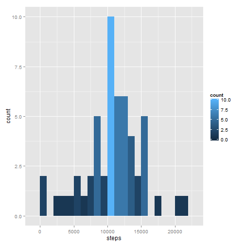
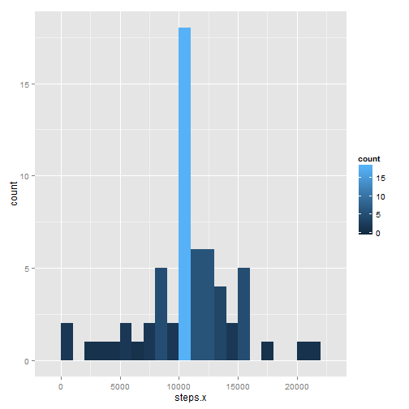

## Loading the data set


```r
activity <- read.csv(file="activity.csv")
library("reshape2")
library("ggplot2")
```

## What is the mean total number of steps taken per day?


```r
totaldailysteps <- aggregate(steps ~ date, data = activity, FUN = "sum")
dailystepsplot <- ggplot(data = totaldailysteps, aes(x=steps))
dailystepsplot + geom_histogram(binwidth = 1000, aes(fill=..count..))
```

 

```r
mean(totaldailysteps$steps)
```

```
## [1] 10766.19
```

```r
median(totaldailysteps$steps)
```

```
## [1] 10765
```

##What is the average daily activity pattern?


```r
averagestepsbytime <- aggregate(steps ~ interval, data = activity, FUN = "mean")

## this block of code uses the interval labels and converts them into military time

time <- c("00:00")
for ( i in 2:288) 
   {
  
     time[i] <- paste(c(as.character(averagestepsbytime[i,1] %/% 1000), as.character((averagestepsbytime[i,1] %% 1000) %/% 100),
                        ':', as.character((averagestepsbytime[i,1] %% 100) %/% 10), as.character(averagestepsbytime[i,1] %% 10) ), collapse = '')
    }

halfhourintervals <- c(1,1+6*1:47)

## By plotting this way, it removes the gaps (between 55 and 00 on every hour) made by the way the data file 
## was set up

plot(averagestepsbytime[,2], type = "l", xaxt = 'n', xlab = '', ylab = 'Daily average steps for each 5 minute interval')
axis(side = 1, at =halfhourintervals , labels = time[halfhourintervals])
```

 

```r
max(averagestepsbytime$steps)
```

```
## [1] 206.1698
```

```r
subset(averagestepsbytime, steps >= 206)
```

```
##     interval    steps
## 104      835 206.1698
```

##Inputting missing values


```r
length(activity[is.na(activity[,1]),1])
```

```
## [1] 2304
```

```r
na_replaced_activity <- merge(activity, averagestepsbytime, by = 'interval')

for (i in 1:17568){
  if (is.na(na_replaced_activity[i,2])) {
    na_replaced_activity[i,2] <- na_replaced_activity[i,4]
  } 
}
revisedtotaldailysteps <- aggregate(steps.x ~ date, data = na_replaced_activity, FUN = "sum")
na_replaced_plot <- ggplot(data = revisedtotaldailysteps, aes(x=steps.x))
na_replaced_plot + geom_histogram(binwidth = 1000, aes(fill=..count..))
```

 

```r
mean(revisedtotaldailysteps$steps.x)
```

```
## [1] 10766.19
```

```r
median(revisedtotaldailysteps$steps.x)
```

```
## [1] 10766.19
```

My method for replacing the NA values was to replace them with the interval mean from across all days.
We can see that there is a small change to the mean and median, but it is pretty negligible.
However, now the mean and median are identical, which is the result of using the means of data points
to replace entire days of missing data.


##Are there differences in activity patterns between weekdays and weekends?


```r
week <- weekdays(as.Date(activity[,2]))
activityweek <- cbind(activity, week)
totaldailystepsweekday <- aggregate(steps ~ week + interval, data = activityweek, FUN = "sum")
weekdayslist <- c("Monday", "Tuesday", "Wednesday", "Thursday", "Friday")
totaldailystepsweekday$week <- factor(totaldailystepsweekday$week %in% weekdayslist, 
         levels=c(FALSE, TRUE), labels=c('weekend', 'weekday'))
qplot(interval, steps, data = totaldailystepsweekday, facets = week~., geom = "line")
```

 
